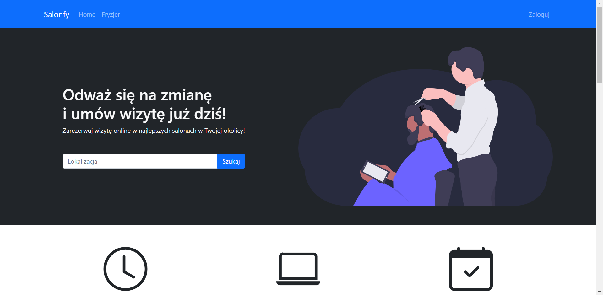
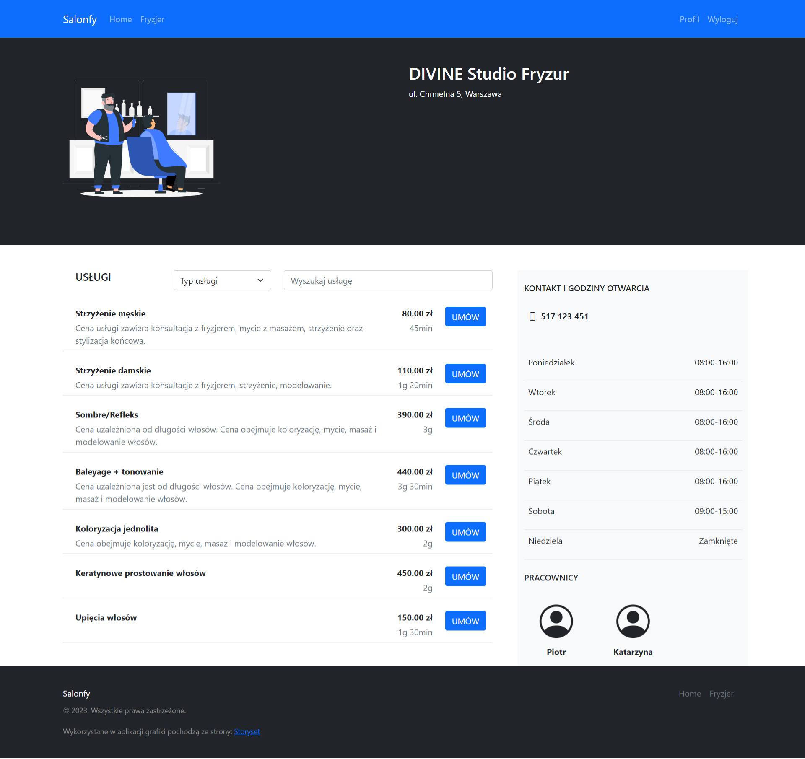
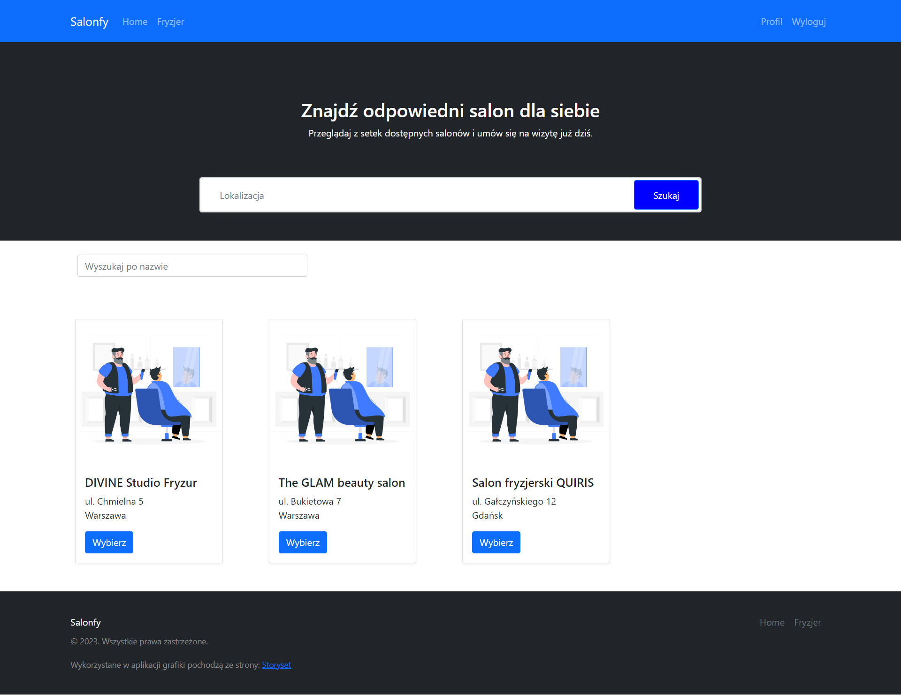
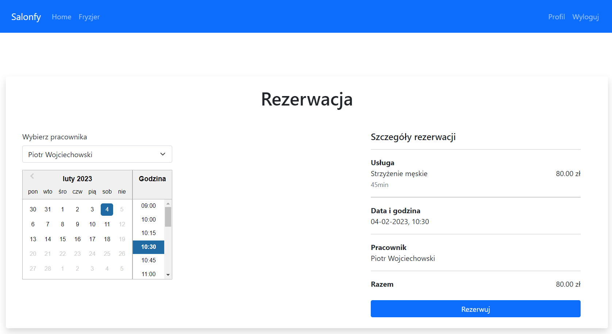
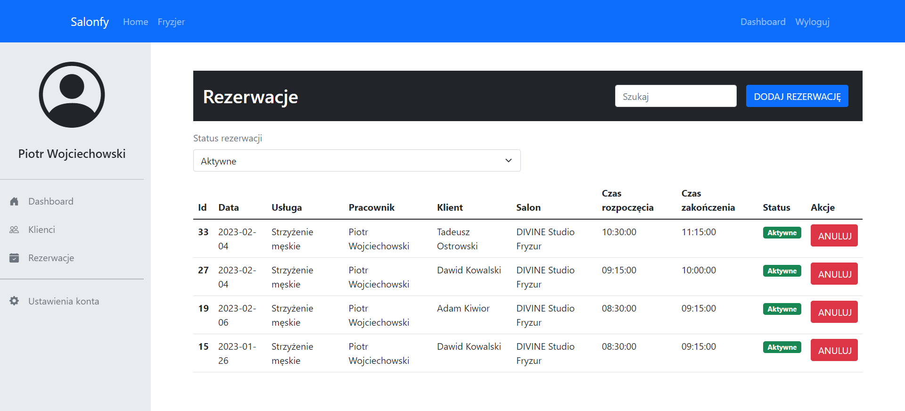
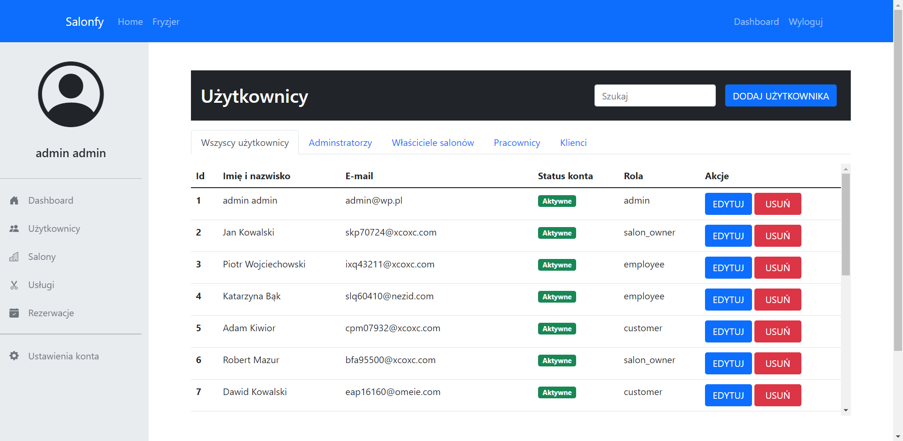

# System rezerwacji dla salonów fryzjerskich

## O projekcie

Aplikacja webowa, która umożliwia rezerwację wizyt online do salonu fryzjerskiego. Klient ma możliwość wyboru salonu fryzjerskiego, zapoznania się z oferowanymi przez salon usługami oraz ich ceną i czasem trwania. Rezerwacja odbywa się poprzez naciśnięcie przycisku „umów” znajdującego się przy konkretnej usłudze. Następnie klient musi uzupełnić niezbędne dane w formularzu, m.in. musi wybrać fryzjera, rodzaj usługi, datę oraz godzinę. System wprowadza ograniczenie rezerwacji na konkretny termin, blokując wybór daty i godziny, która została już zarezerwowana przez innego użytkownika.

Do implementacji systemu wykorzystano nowoczesne technologie. Back-end aplikacji został stworzony za pomocą frameworka Django, napisanym w języku Python, z wykorzystaniem Django REST framework. Natomiast do napisania front-endu posłużył język JavaScript z wykorzystaniem biblioteki React.js. Na relacyjną bazę danych wybrano PostgreSQL.

## Screenshots

## Funkcjonalności
- logowanie i rejestracja w systemie nowych użytkowników,
- możliwość rezerwacji wizyty poprzez stronę internetową,
- możliwość tworzenia nowych rezerwacji bez konieczności użycia aplikacji przez klienta,
- wyświetlenie listy salonów fryzjerskich wraz z listą oferowanych usług,
- możliwość filtrowania listy salonów fryzjerskich po miejscowości oraz rodzaju usługi,
- możliwość  dokonania  rezerwacji  wizyty  w  wybranym  terminie, pod warunkiem że jest on wtedy dostępny,
- zarządzanie rezerwacjami (CRUD),
- podgląd historii wizyt przez klienta oraz możliwość anulowania wizyty,
- wysyłanie użytkownikom wiadomości e-mail z potwierdzeniem rezerwacji,
- zarządzanie użytkownikami (CRUD),
- zarządzanie pracownikami (CRUD),
- zarządzanie salonami fryzjerskimi (CRUD),
- zarządzanie usługami (CRUD),
- edycja danych konta użytkownika,
- walidacja poprawności wprowadzonych danych

## Część serwerowa
https://github.com/kamillon/HairdresserBookingSystem-Backend